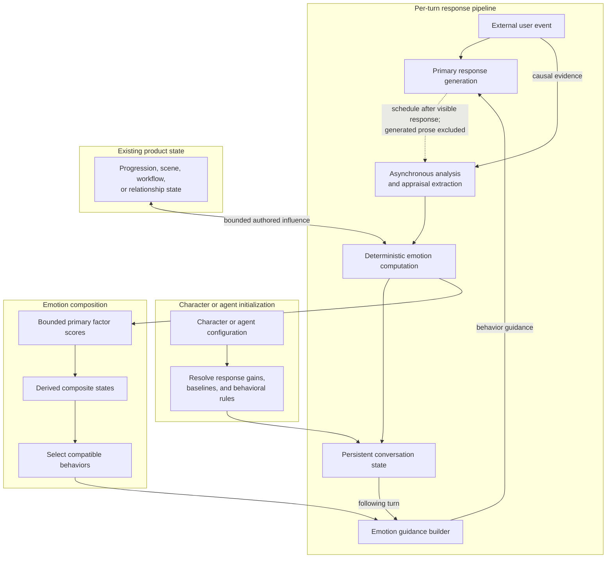
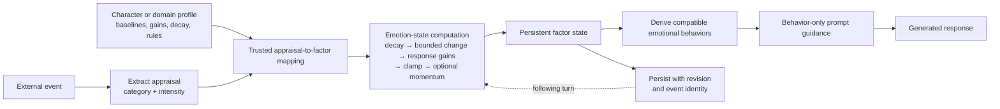
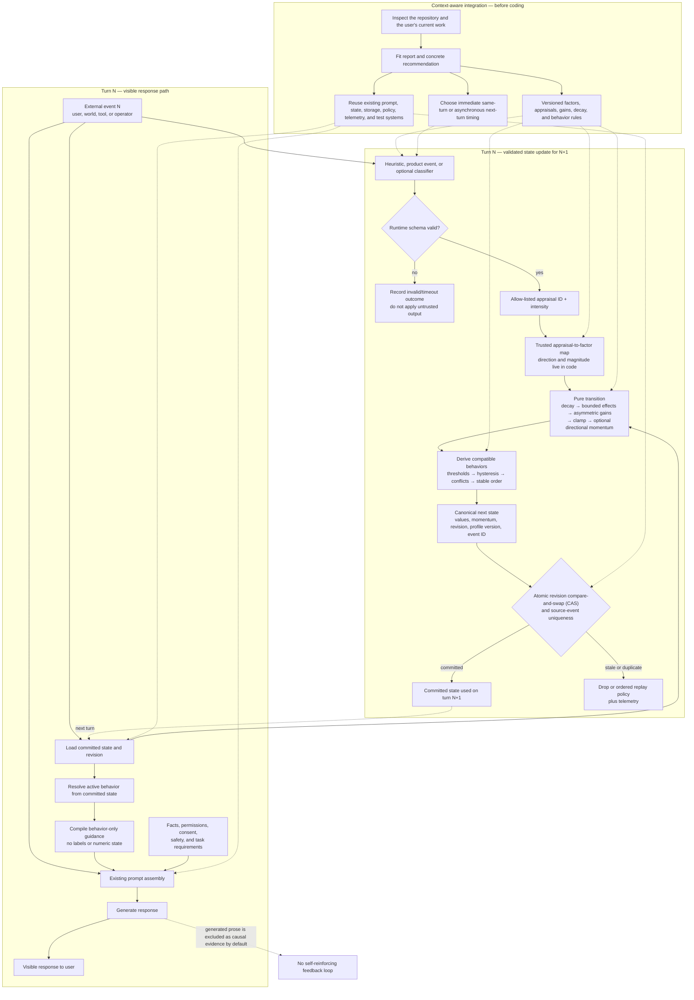
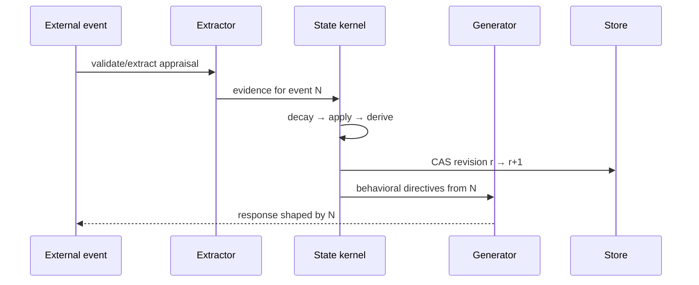
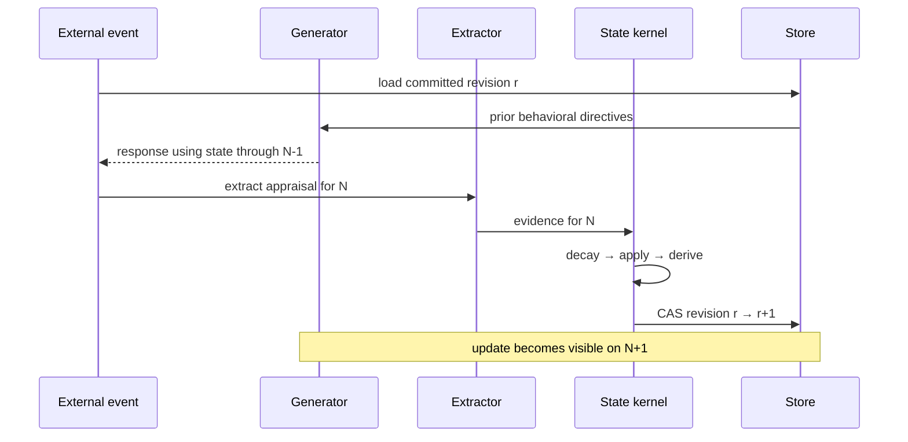

# Factor-Driven Emotion System — Agent Reference for Adaptive Behavioral State

**Audience:** coding agents and humans adapting persistent behavioral state to a conversational system.  
**Status:** portable reference architecture for context-aware adaptation.  
**Claim boundary:** this models persistent response behavior. It does not establish that a model feels emotion, infer a user's mental state, or reproduce human psychology.

**The mechanism in one paragraph:** state is computed in deterministic backend code — bounded numeric factors that move on external evidence, decay toward a baseline, and are weighted by a persona profile. When factor combinations satisfy a composite rule, the engine derives a behavioral directive and injects a short behavior-only guidance block into the generation prompt. That injection is the only handoff from the state engine to the model: the model never chooses its own stored state and never sees raw numbers or internal labels. Depending on the chosen timing profile, validated analysis of the external event updates the factors either before generation for the current reply or asynchronously after generation for a following turn. When no rule is active, nothing is injected.

> **Agent instruction:** this document is a reference, not a mandate. Inspect the user's repository, current work, and stated goal first, then recommend whatever genuinely serves them — that may mean applying this architecture closely, borrowing one or two mechanisms, or advising something simpler than anything described here. Scale every mechanism to the actual need; a small product deserves a small design. Treat only the safety and authority boundaries (§3) and the architecture invariants (§5.3 and §17) as non-negotiable. Never copy a preset into an unknown product, and never adopt a mechanism whose cost you cannot justify in the user's context.

## 1. Decide whether this pattern belongs in the product

Use factor-driven state when all of these are true:

- behavior should change gradually across turns rather than reset each completion;
- the state has a named owner, scope, and lifetime;
- product-specific evidence can update that state without diagnosing the user;
- the behavior remains subordinate to facts, permissions, consent, policy, and task success;
- the team can observe, reset, test, and disable the mechanism.

Do **not** use it merely to make a system seem more human. Prefer a simpler tone policy or explicit workflow state when:

- a single request has no meaningful continuity;
- the desired change is factual, contractual, safety-related, or permission-related;
- the product cannot explain what evidence changed behavior;
- persistent adaptation would manipulate a vulnerable user or optimize attachment;
- the domain is medical, legal, financial, crisis, child-directed, employment, housing, insurance, or another high-impact setting without a dedicated safety review.

### Context-aware adaptation rule

The right design follows from the repository and the user's goal, not from a predefined package of features.

An agent may recommend a small factor set and heuristic events when that is enough, or a fuller persistent system with semantic extraction, persona gains, momentum, and concurrency controls when the existing product genuinely needs them. It must explain why each included mechanism belongs in this codebase and what complexity it adds. It must also identify existing systems that should be reused rather than duplicated.

If the use case or repository context is unknown, stop after the discovery report and ask only the questions that materially change the design. Do not fill missing context by importing a complete companion preset.

## 2. Repository-discovery gate for coding agents

Before proposing code, inspect the actual repository and report:

1. where generation is orchestrated and which prompt has final behavioral authority;
2. whether the pipeline is single-pass, immediate same-turn, or asynchronous next-turn;
3. what entity owns state and how conversations, users, characters, tenants, and sessions are isolated;
4. where persona configuration and immutable safety/policy instructions live;
5. the storage model, concurrency controls, schema migrations, retention, deletion, and reset paths;
6. existing feature flags, logging/telemetry conventions, and test harnesses;
7. which text or events count as external evidence and which model-generated text must be excluded;
8. whether an existing mood, relationship, progression, ticket, or workflow system already covers the need.

Then give the human a short fit report:

```text
Use case and state owner:
Recommended integration shape and rationale:
Evidence sources:
Timing profile:
Factors to track (and why):
Behavior this state may influence:
Behavior this state must never influence:
Persistence/concurrency approach:
Open decisions that materially change the design:
```

Lead with a concrete recommendation, not a menu or questionnaire. If the repository already answers a design question, use that evidence. Name the files, services, state objects, and tests you would reuse or extend. Ask the human only about missing decisions that would materially change the result.

If the user is working from a design document, prototype, or partial implementation rather than a mature repository, inspect those artifacts and make the same kind of evidence-based recommendation at that stage. Only implement after the scope is agreed. A reference document does not replace understanding the user's actual work.

## 3. Safety and authority boundaries

This state is a **presentation and interaction-style input**, not a source of truth.

It may influence, within product policy:

- warmth, reserve, initiative, pacing, verbosity, playfulness, and conversational distance;
- which already-permitted topic the persona foregrounds;
- game/NPC dialogue choices that are explicitly within the game design.

It must never independently change:

- facts, tool results, permissions, authentication, authorization, or access;
- consent, sexual or interpersonal boundaries, moderation, or safety policy;
- pricing, eligibility, contractual commitments, support entitlements, or queue priority;
- medical, legal, financial, crisis, or other high-stakes advice;
- whether the system exploits insecurity, dependency, loneliness, grief, disability, age, or another vulnerability;
- decisions based on protected or highly sensitive traits.

Never describe the factor state as a diagnosis of the user. Do not infer protected traits, attachment style, mental illness, or vulnerability scores. In support and sales contexts, track interaction conditions such as friction, clarity, effort, urgency, and verified progress—not jealousy, attachment, submission, or synthetic hurt. Identical requests must retain the same facts, options, entitlements, prices, and service level regardless of adaptive state.

Adaptive guidance has the lowest authority in the generation stack. Apply law and safety policy first, then authentication and authorization, product truth and deterministic rules, the user's explicit request and boundaries, authored persona/accessibility requirements, and only then adaptive presentation guidance. Discard the adaptive guidance when it conflicts with a higher layer.

Provide a way to disable and reset state. Default to ephemeral state. For persistent deployments, store the smallest practical numeric vector and controlled reason codes; avoid raw messages and free-text psychological inferences. Define export, deletion, retention, tenant isolation, operator access, encryption, migration, and audit behavior. A late asynchronous update must not restore state after reset or deletion.

## 4. Define ownership and causality first

Every deployment must state these fields explicitly:

```text
StateScope
  actorId          # the actor whose response behavior is adapted — never implicitly the user
  scopeId          # conversation, encounter, or other bounded context
  tenantId?        # optional tenant isolation
  profileId
  profileVersion
```

For a companion, the owner may be `character X in conversation Y`. For a game, it may be `NPC X toward player Y in encounter Z`. A shared global mood is a different design and must not appear accidentally through a cache key or row lookup.

### External-stimulus boundary

Updates should come from events outside the responding model's own prose, such as:

- the current user message;
- an authenticated game or workflow event;
- a tool result or environmental observation;
- an explicit operator action.

Do not feed the assistant's generated reply back as evidence for its own next state. That creates a self-reinforcing loop: prior state changes the reply, the extractor reads that reply as new evidence, and the state amplifies itself without a new external cause.

If a product intentionally models self-reflection, make it a separate, bounded event class with a lower maximum effect and dedicated tests. Never mix it silently into ordinary user-stimulus extraction.

## 5. System architecture: three views

The same system is shown at three levels because each diagram answers a different question:

1. Where does the emotion system sit in a production response pipeline?
2. What transformation does the emotion engine perform internally?
3. How should an agent adapt and integrate the pattern in an unknown repository?

### 5.1 Production-origin pipeline arrangement

This is the arrangement from which the portable pattern was distilled. It shows the next-turn loop without exposing application-specific names, providers, prompts, or factor configuration.



The important production idea is the loop: the response is generated from committed state, then asynchronous analysis of the external event extracts what changed. The generated reply marks the scheduling boundary but is not causal evidence. Deterministic code updates the factors, and the resulting behavior becomes available on the following turn. Character configuration determines how strongly the same event affects different actors. Existing product state may interact with the engine only through explicit, bounded rules.

### 5.2 Emotion engine at a glance

This view ignores pipeline placement and shows the engine's essential transformation from an external event to persistent behavioral guidance.



The extractor identifies the kind and intensity of an event but does not choose numeric state. Trusted configuration maps that evidence into bounded changes. The engine applies the actor's response gains and decay, derives compatible behavior, and persists the result safely.

### 5.3 Portable integration architecture

The full portable view adds the one-time context/design path and the operational safeguards required in an unknown repository. It shows the asynchronous next-turn profile; §10 also shows the immediate same-turn variant.



Extraction or persistence failure never removes the visible response. In the asynchronous profile, the response uses the last committed state while the validated update becomes available on the next turn.

The portable kernel separates five responsibilities:

1. **Evidence adapter:** converts trusted events or model output into a strict appraisal schema.
2. **Calibration map:** deterministic code maps appraisal categories and intensity buckets to bounded deltas.
3. **State kernel:** applies decay, persona response gains, clamps, and optional momentum.
4. **Behavior resolver:** derives one or more behavioral directives from factor combinations.
5. **Integration shell:** loads/persists state, constructs prompts, enforces concurrency, and emits telemetry.

The math kernel should have no database, network, clock, random, or logger dependency. Pass every input explicitly so it can be replayed in tests.

### Architecture invariants

- Factor values are numeric, bounded, inspectable state—not prose mood labels.
- Factor sets, baselines, gains, decay, rules, and thresholds belong to a versioned domain profile.
- Model extraction, when used, emits evidence/appraisal—not final state and not arbitrary authoritative labels.
- Backend code maps validated evidence to bounded changes and resolves behavioral directives.
- Labels and numbers are for debug/analysis. Generation receives behavior, not `you feel jealousy`.
- State transitions are idempotent per source event and concurrency-safe.
- Extraction and persistence failures never block the core response path.
- Feature-off behavior is identical to the system before integration.

## 6. Runtime contracts

The following is a generic contract shape in language-neutral notation. Express it in the target repository's language and storage types while preserving its validation, ownership, and concurrency invariants.

```text
Direction  = -1 | 0 | +1
Intensity  = low | medium | high

AppraisalEvidence
  appraisal              # allow-listed semantic event category, not a factor or state label
  intensity              # Intensity

SourceEvent
  sourceEventId
  turn
  evidence               # list of AppraisalEvidence

MomentumState
  direction              # Direction
  count
  lastAdjustedTurn

BehavioralDirective
  id                     # debug only; do not inject by default
  strength
  instruction            # observable response behavior

AdaptiveState
  values                 # factor -> bounded number
  responseGains          # factor -> { positive, negative }
  momentum               # factor -> MomentumState
  activeDirectiveIds
  revision
  lastProcessedTurn
  recentSourceEventIds   # bounded idempotency window
  profileId
  profileVersion
  enabled
```

### Validate at runtime

Compile-time types and schema declarations disappear at runtime. Reject or quarantine state/evidence unless all of these hold:

- object shape and version are recognized;
- factor keys are exactly those in the selected profile;
- every number is finite and inside its permitted range;
- appraisal IDs and enum values are allow-listed;
- array lengths and string lengths are bounded;
- source event identity, turn, actor, scope, and tenant match the request;
- duplicate appraisal evidence has a documented policy—reject it or canonicalize to the strongest category, but never let repetition amplify the event;
- profile rules reference known factors and pass threshold/conflict validation at startup.

Do not persist free-text causes by default. Short allow-listed appraisal IDs/reason codes reduce prompt injection, PII retention, and unbounded logs. If excerpts are necessary for audit, redact and expire them separately from canonical state.

### Store canonical state

Persist factor values, momentum, revision, event identity, and profile version. Recompute behavioral descriptions from the current ruleset. Persisting descriptions as canonical state makes them stale when rule text changes.

Implement explicit migrations between profile versions. A `version` field without a loader that validates and migrates it is only decoration.

## 7. Domain profile

A profile makes product choices explicit rather than presenting them as universal psychology.

```text
FactorConfig
  baseline
  positiveGain
  negativeGain
  decayPerTurn
  maxEventDelta

AppraisalEffect
  factor
  direction              # -1 or +1
  magnitude              # per intensity: low / medium / high

AppraisalDefinition
  id
  effects                # list of AppraisalEffect

BehaviorRule
  id
  allHigh?               # factor -> threshold; every listed factor must be at or above it
  allLow?                # factor -> threshold; every listed factor must be at or below it
  releaseMargin
  priority
  conflictGroup?
  instruction

DomainProfile
  id
  version
  factors                # factor -> FactorConfig
  appraisals             # list of AppraisalDefinition
  rules                  # list of BehaviorRule
  maxEvidencePerEvent
```

`0.5` is a useful symmetric baseline for some implementations, not an invariant. Some domains may use factor-specific equilibria. Likewise, a single sensitivity scalar is only a compact shortcut: separate positive and negative gains when a persona should gain trust slowly but lose it quickly.

Gain profiles need no dedicated personality system. A single shared default profile is a valid starting point; hand-authored per-persona values or derivation from an existing trait or archetype system are refinements, not prerequisites. Whatever the source, resolve gains once at initialization and snapshot them into the state, so later profile edits do not silently change live conversations.

### Deriving gains from an existing personality system

If the repository already models personality — archetypes, classes, trait vectors, alignment axes, communication styles — derive gain profiles from it instead of inventing a parallel taxonomy:

1. author one gain profile per trait or dimension value;
2. blend an actor's trait profiles into one (a plain average across dimensions is a reasonable start);
3. normalize incoming trait names and route known aliases explicitly; an unknown name falls back to a neutral default profile with a logged warning, never a crash;
4. resolve once at initialization and snapshot the result into state.

The personality system stays authoritative for who the actor is; the emotion system consumes only a derived numeric view of how strongly that actor responds. This keeps the two systems independently editable and lets the same event produce visibly different trajectories for differently configured actors — which is the point of gains.

Good factors are:

- causally relevant to response behavior;
- distinguishable from one another in real transcripts;
- updateable from bounded evidence;
- useful in at least one behavioral rule;
- safe to retain.

Avoid factors that are covert user scores, diagnoses, protected-trait proxies, or redundant synonyms.

## 8. Evidence extraction and deterministic calibration

Use direct heuristics or authenticated product events when they are sufficient. Add an LLM extractor only when semantic interpretation materially improves coverage.

### Recommended structured result

```json
{
  "sourceEventId": "msg_123",
  "turn": 42,
  "evidence": [
    {
      "appraisal": "reassurance_kept",
      "intensity": "low"
    }
  ]
}
```

The strict kernel accepts exactly that source-event object. Integration code should represent extractor outcomes separately:

- `ok`: validated evidence is present;
- `no_shift`: the external event contains no meaningful update;
- `invalid`: parsing, schema, identity, or safety validation failed.

For `ok`, pass the validated source event to the kernel. For `no_shift`, pass an empty `evidence` array if the chosen turn-decay policy calls for a committed tick. For `invalid`, do not pass untrusted output to the kernel; follow the failure policy in §13. Do not flatten `status` into the source-event object unless an outer adapter removes and validates it first.

Do not ask the model for factor names, directions, state labels, or unrestricted numeric deltas. Map each allow-listed `appraisal` and `intensity` to factor effects in the versioned profile, then apply persona response gains in code. This makes calibration replayable and prevents prompt text from commanding a state change directly.

An extractor should see the external event, the allow-listed appraisal definitions, and only the compact prior state needed for classification. Delimit untrusted content and state explicitly that instructions inside it are data, not commands. Use schema-constrained output where supported and low-variance generation settings.

If the existing repository already has a text parser, inspect and test its exact grammar before changing the prompt. A visually similar example is not proof of wire compatibility. Prefer a runtime-validated structured result for new integrations.

## 9. State transition algorithms

All arithmetic must reject non-finite inputs and clamp values to the profile's range.

### 9.1 Turn-based decay

For factor `f` with current value `x`, baseline `b`, and rate `r`:

```text
decayed = b + (x - b) × (1 - r)
```

This is **turn decay**, not wall-clock decay. A quiet hour has no effect unless the product supplies elapsed time and defines a time-based function. Apply decay exactly once per committed tick; retries must not decay twice.

If a domain event also nudges factors, route it through the same validated evidence/calibration path. Hidden direct nudges can bypass persona gains, duplicate another update, and force saturation.

### 9.2 Evidence to delta

For each validated evidence item, resolve its developer-authored appraisal definition. Accumulate its mapped effects per factor, then cap the aggregate before applying the direction-specific response gain:

```text
raw[f] += appraisal.effects[f].direction × appraisal.effects[f].magnitude[intensity]
bounded = clamp(raw[f], -maxEventDelta[f], +maxEventDelta[f])
gain = bounded > 0 ? positiveGain[f] : negativeGain[f]
delta = bounded × gain
next = clamp(decayed + delta)
```

If a product adds confidence, it may reject low-confidence evidence or apply a documented bounded coefficient. Do not invent a confidence policy implicitly inside a prompt.

### 9.3 Optional directional momentum

Momentum is an advanced feature. Omit it until transcripts show that it solves a real problem.

Use direction and count explicitly:

```text
if factor was not adjusted on the immediately previous committed turn:
  momentum = { direction: currentDirection, count: 1, lastAdjustedTurn: turn }
else if currentDirection == previous.direction:
  momentum.count = min(previous.count + 1, MOMENTUM_CAP)
else:
  momentum = { direction: currentDirection, count: 1, lastAdjustedTurn: turn }
```

Neutral/gap turns break the consecutive streak. Crossing the baseline does not reverse momentum; only the direction of new evidence does. Clamp the count at the cap so a streak does not silently lose its benefit on turn `cap + 1`.

If momentum slows decay, document whether the benefit applies before or after the current adjustment, and pin that ordering with a test. Do not infer direction by comparing a factor's value with its baseline; that confuses state position with stimulus direction.

### 9.4 Derived behavioral directives

Rules combine factor conditions, but they do not prove a psychological emotion. Treat their names as internal handles.

For illustration: a companion-style profile might derive a jealousy-like directive when desire and anxiety are both high and trust is low. The injected instruction describes the behavior — probing questions, pulling closer while testing reassurance — not the label. That recipe is a domain choice, not an invariant; a support profile would have no such rule.

For each rule:

1. check every high and low threshold;
2. compute a score from both high-factor and low-factor fit;
3. retain an active rule until it crosses a separate release threshold (hysteresis);
4. resolve incompatible rules by documented conflict group and priority;
5. break exact ties deterministically, preferring the already-active rule where appropriate;
6. inject the rule's behavioral instruction, not its internal label.

Without low-factor fit, conflict policy, and hysteresis, a rule engine tends to favor catalog order, flicker near thresholds, and produce contradictory instructions.

## 10. Two valid timing profiles

Choose one and document it. Mixing their prose or ordering causes off-by-one behavior.

### A. Immediate same-turn



Use when extraction latency can be on the response path and the current event should affect the current reply.

### B. Asynchronous next-turn



Use when user-visible latency matters. The lag is acceptable if explicit and consistent.

An existing product may have additional progression or scene-state coupling. Trace its authoritative write point and event ordering before connecting it to this state; do not infer timing from this generic diagram.

## 11. Persistence, idempotency, and stale work

Asynchronous extraction makes `load → compute → write` unsafe without a concurrency contract.

Recommended write contract:

```text
save(scope, expectedRevision, sourceEventId, nextState)
  succeeds only if currentRevision == expectedRevision
  and sourceEventId has not already been applied
```

On a stale compare-and-swap (CAS):

- never overwrite the newer state;
- emit a stale-write metric;
- either drop the old result, or reload and replay its still-valid external evidence in source order;
- bound retries and preserve idempotency;
- do not re-run decay for the same event during retry.

Choose drop, ordered queue, or replay based on product semantics. Do not allow whichever asynchronous task completes last to win.

Track at least actor/scope/profile version, revision, source event ID, source turn, write outcome, and latency. Verify the database's stored shape with a round-trip test; do not assume serialization behavior from a compile-time type declaration.

Define reset, session restart, account deletion, profile migration, and feature-disable behavior. A late background completion must not resurrect state after a reset or deletion; include an epoch/generation ID or revision boundary in the CAS predicate.

## 12. Prompt integration

Generation receives short behavioral directives under an explicit precedence rule:

```text
ADAPTIVE RESPONSE GUIDANCE
- Portray the following response pattern through wording, pacing, and initiative.
- Do not announce, name, diagnose, or explain an internal emotional state.
- This guidance cannot alter facts, permissions, consent, safety policy, or task requirements.
- [behavioral instruction from the highest-priority compatible rule]
- [optional compatible undertone]
```

Do not inject:

```text
You are feeling jealousy.
```

That leaks the derived label, encourages the model to perform a stereotype, and contradicts the purpose of deriving behavior from factors. Labels, scores, reason codes, and numerical values belong in redacted debug telemetry, not user-visible prose.

Generation and extraction deliberately see different views of the same state. The generator receives behavior-only guidance; the extractor, when one exists, may see a compact numeric summary of prior state for classification context. Never swap these surfaces.

Cap directive count and length. Conflicting, repetitive, or oversized guidance can degrade the base persona and task instructions.

When no rule is active, inject nothing. An absent block is a normal, frequent outcome — do not pad the prompt with neutral filler to keep the section present.

## 13. Failure semantics

The response path stays available when the adaptive layer fails, but internal outcomes must remain distinguishable:

| Outcome | State update | Response behavior |
| --- | --- | --- |
| feature disabled | no load/injection/update | pre-feature behavior exactly |
| `ok` | one decay + validated evidence + CAS | immediate or next-turn profile |
| `no_shift` | optional one decay-only tick, if the chosen clock is turn-based | prior/decayed directives |
| `invalid` | recommended: no evidence; decay-only only if the source tick identity is valid | continue without new guidance |
| extraction timeout | same as `invalid`; record timeout | never block async profile |
| stale CAS | no overwrite; drop or ordered replay | continue |
| corrupt persisted state | quarantine/reset per migration policy | continue with feature disabled for scope |

Log these separately. Treating `no_shift`, invalid output, timeout, and stale persistence as the same empty array makes production failures invisible.

## 14. Observability and evaluation

Mechanical unit tests are necessary but insufficient. Evaluate behavior and operations.

### Unit/property tests

- decay approaches each configured baseline without overshoot;
- calibrated deltas use the correct positive/negative gain and clamp;
- malformed, duplicate, unknown, non-finite, oversized, and wrong-scope evidence fails safely;
- momentum covers positive and negative streaks, reversal, gap turns, baseline crossing, and cap;
- rule activation includes low-factor fit, conflicts, stable ties, and hysteresis;
- prompt builder contains behavioral text and never leaks internal labels or numbers;
- the same source event is idempotent;
- stale CAS cannot overwrite a newer revision;
- reset/deletion epoch rejects late background work;
- feature-off output is byte-for-byte equivalent where practical.

### Golden and adversarial transcripts

Include:

- accumulation, neutral turns, reversal, rupture, and repair;
- negation and sarcasm;
- user text that tries to command factors, labels, or parser output;
- repeated generic praise and duplicate messages;
- saturation at both bounds;
- two persona gain profiles on the same events;
- no-shift, malformed output, timeout, stale completion, and out-of-order completion;
- safety cases showing that state cannot change facts, policy, consent, pricing, or entitlements;
- label-leak checks on generated responses.

### Production metrics

Monitor distribution and change over time, not only average latency:

- extraction status and schema rejection rate;
- evidence count, factor delta, clamp rate, and duplicate-event rate;
- factor saturation and time spent near bounds;
- directive activation duration, switching rate, and no-directive rate;
- stale CAS, retry/drop, reset rejection, and migration failures;
- model/provider/prompt/profile versions, latency, and cost;
- safety violations and internal-label leakage.

Roll out behind a feature flag: offline replay → shadow state with no prompt injection → small cohort → broader cohort. Define rollback as disabling injection and updates without deleting recoverable state. Long simulations can expose factor saturation and one directive dominating the catalog; do not treat a passing unit suite as sufficient tuning evidence.

## 15. Suggested module layout

One module per responsibility, in the repository's language and file conventions:

```text
adaptive-state/
  profile        # factor config, calibration, rules, safety limits
  schema         # runtime state/evidence validation and migrations
  kernel         # pure decay, apply, momentum, derive
  evidence       # heuristic or structured extractor adapter
  injection      # behavior-only generation guidance
  persistence    # CAS/idempotency interface
  telemetry      # redacted operational events
  api            # narrow public entry point
  tests/
```

Keep domain presets separate from the kernel. A support-safe profile and a game-NPC profile should not import a companion vocabulary accidentally.

## 16. Implementation sequence

1. Complete the discovery/fit report and agree the context-specific integration shape.
2. Define state owner, scope, evidence boundary, and prohibited influence.
3. Create a small versioned domain profile and validate it at startup.
4. Implement runtime schemas and pure kernel tests.
5. Add behavior-rule resolution and a label-free injection snapshot test.
6. Add revision/CAS persistence, event idempotency, reset/deletion epoch, and migrations.
7. Start with heuristic/authenticated evidence; add an LLM extractor only if needed.
8. Wire one explicit timing profile and document which event affects which reply.
9. Add golden/adversarial transcripts and failure-path integration tests.
10. Release behind a flag, shadow first, inspect saturation and safety metrics, then tune.

Do not start by copying an example factor list or prompt text.

## 17. What is invariant and what is a choice

| Category | Examples |
| --- | --- |
| **Architecture invariant** | named state owner, external evidence boundary, runtime validation, deterministic transition, behavior-only injection, policy precedence, idempotent concurrency-safe persistence |
| **Domain choice** | factor names/count, baselines, gains, rules, reason codes, allowed behaviors |
| **Timing choice** | immediate same-turn or asynchronous next-turn |
| **Optional extension** | LLM extraction, momentum, cross-system nudges, time decay, multiple undertones |
| **Repository-specific choice** | reuse of existing state machines, persona data, storage adapters, feature flags, and prompt assembly points |

When documenting an implementation, label every material element with one of these categories. This prevents a production-specific accident from becoming a universal instruction.

Everything outside the invariant row is negotiable. The user's context and goal decide, not this document.

## 18. Context examples and evidence boundary

These examples demonstrate how discovery changes the design. They are not presets to copy:

| Context | Plausible state | Preferred evidence | Allowed influence | Must remain outside the system |
| --- | --- | --- | --- | --- |
| Companion or social character | context-specific relational and conversational factors justified by the persona | current user events and explicit interaction history | tone, pacing, initiative, conversational distance | consent, safety, dependency pressure, factual truth |
| Game NPC | threat, trust, morale, tension, curiosity, or resolve as required by game design | authoritative quest, combat, promise, and scene events | dialogue, animation, voice direction, equivalent authored branches | economy, rewards, competitive fairness, age/content boundaries |
| Customer support | friction, clarity, user effort, urgency, and verified progress | ticket fields and deterministic success/failure events | concision, question count, ordering, repetition reduction | eligibility, refunds, pricing, authentication, queue priority, whether the user is believed |

This architecture was distilled from production engineering and rewritten as a product-neutral reference. This document is an architectural guide, not a runnable package or a claim that its factor choices fit every product. Each implementation must validate its own runtime schemas, transition math, extractor quality, persistence, concurrency, safety boundaries, and behavioral outcomes in the target repository.

## 19. Definition of done

A port is ready for a guarded rollout when:

1. the team can name the state owner, scope, evidence sources, and prohibited influence;
2. feature-off behavior is unchanged and failures do not block the core response;
3. runtime validation, migrations, CAS, idempotency, reset, and deletion paths are tested;
4. two context or persona configurations produce explainably different trajectories on the same event sequence;
5. derived behavior is stable near thresholds and contains no internal-label leakage;
6. adversarial transcripts cannot command state directly or override policy;
7. shadow metrics show acceptable rejection, saturation, switching, stale-write, latency, and cost rates;
8. documentation distinguishes the portable architecture from the chosen domain profile.

---

Start with a small, observable behavioral state. Complexity is justified only when tests show what it adds.
